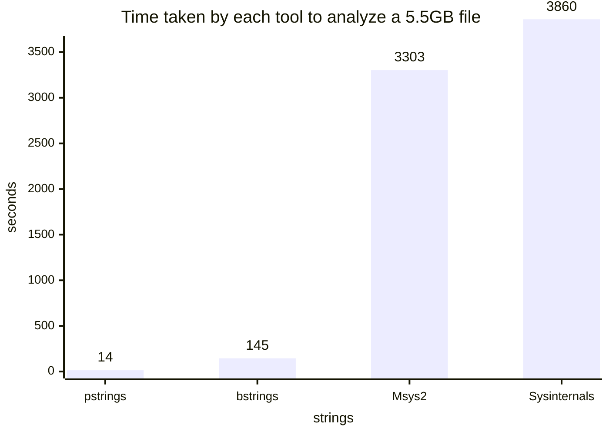

# pstrings

## pstrings - Parallel strings extractor for very large files


## Features

- Extracts both ASCII and UNICODE (UTF-16LE) strings at once (like Sysinternals strings)
- Runs fast using multiple threads
- Supports multiple encodings (Experimental)
  - UTF-8, UTF-16LE, CP932 (Shift-JIS), ISO-2022-JP, Windows-1252 (Latin1), EUC-KR, GB18030, GBK, BIG5, Windows-1251
- Memory-efficient even on huge files (about 24MB per worker thread)


## Use Cases

- Digital forensics: extracting readable strings present in memory images or unallocated disk space


## Speed Comparison

### Results



### Conditions
- CPU
  Intel Core i9 2.80GHz (32 Core)
- Memory
  128 GB
- OS
  Windows Server 2025 Standard
- Input file size
  5.50 GB

### pstrings 0.1.45

```powershell
Measure-Command { .\Tools\pstrings.exe -s -o output.txt xxx.bin }

Days              : 0
Hours             : 0
Minutes           : 0
Seconds           : 13
Milliseconds      : 884
Ticks             : 138844483
TotalDays         : 0.000160699633101852
TotalHours        : 0.00385679119444444
TotalMinutes      : 0.231407471666667
TotalSeconds      : 13.8844483
TotalMilliseconds : 13884.4483
```


### Sysinternals strings v2.54

```powershell
Measure-Command { .\Tools\SysinternalsSuite\strings.exe -nobanner -n 4 xxx.bin > output.txt }

Days              : 0
Hours             : 1
Minutes           : 4
Seconds           : 20
Milliseconds      : 141
Ticks             : 38601414731
TotalDays         : 0.0446775633460648
TotalHours        : 1.07226152030556
TotalMinutes      : 64.3356912183333
TotalSeconds      : 3860.1414731
TotalMilliseconds : 3860141.4731
```


### MSys2 bintuils strings 2.46

```powershell 
Measure-Command { `
  .\Tools\msys64\usr\bin\strings.exe -e s xxx.bin > output.txt ; `
  .\Tools\msys64\usr\bin\strings.exe -e l xxx.bin >> output.txt ; `
}

Days              : 0
Hours             : 0
Minutes           : 55
Seconds           : 3
Milliseconds      : 367
Ticks             : 33033679276
TotalDays         : 0.038233425087963
TotalHours        : 0.917602202111111
TotalMinutes      : 55.0561321266667
TotalSeconds      : 3303.3679276
TotalMilliseconds : 3303367.9276
```


### Eric Zimmerman's bstrings 2026.5.0

```powershell
Measure-Command { .\Tools\EZTools\net9\bstrings.exe -s -m 4 -f xxx.bin -o output.txt }

Days              : 0
Hours             : 0
Minutes           : 2
Seconds           : 25
Milliseconds      : 266
Ticks             : 1452668352
TotalDays         : 0.00168132911111111
TotalHours        : 0.0403518986666667
TotalMinutes      : 2.42111392
TotalSeconds      : 145.2668352
TotalMilliseconds : 145266.8352
```


## Usage

```bash
pstrings input.bin
pstrings -s input.bin
pstrings -s -o output.txt input.bin
pstrings -m 3 -o output.txt input.bin
pstrings -o output.txt input.bin -f ascii,latin1
pstrings -o output.txt input.bin -e utf16le -f kanji-jis1,cjkpunct,hiragana,katakana
pstrings -o output.txt input.bin -e cp932
pstrings -j 8 -o output.txt input.bin
pstrings -o output.txt --temp-dir D:\PathToSsdOrFastDrive input.bin
```


## Arguments/Options

```bash
> pstrings --help

Parallel strings extractor for very large files

Usage: pstrings.exe [OPTIONS] <INPUT>

Arguments:
  <INPUT>
          Input file

Options:
  -s, --string-only
          Omit the offset and encoding columns, printing only the matched text

  -o, --output <OUTPUT>
          Output file. [default: stdout]

  -e, --encoding <ENCODING>
          Input encoding(s), repeated or comma-separated. [default: ascii, utf16le-ascii]

          [possible values: ascii, utf16le-ascii, utf16le, utf8, iso2022-jp, cp932, gbk, euc-kr, windows-1251, big5, gb18030]

  -f, --filter <FILTER>
          Character filter(s): which characters may appear in a match.
          Repeat the option or comma-separate to select multiple; a
          character is kept if any selected filter allows it.
          [default: ascii].

          A "string" in a binary file is a guess, and most encodings can
          check the guess themselves: UTF-8 has strict well-formedness
          rules, and the CJK multi-byte encodings only accept sequences
          their standard assigns. Two cannot. In UTF-16LE any byte pair is a
          valid code unit, and in windows-1251 every byte is a character, so
          scanning either without restricting *which* characters count would
          report most of the file as text. Narrowing pays off sharply: if a
          fraction p of characters are admitted, false positives scale as
          p^min-length.

            utf16le, windows-1251   essential, as above
            ascii, utf16le-ascii    only picks ascii vs. ascii,latin1
            all others              ignored (they validate structurally)

          So dropping ascii to quiet utf16le will not silently narrow utf8,
          cp932, gbk, gb18030, euc-kr, big5 or iso2022-jp -- they always
          match plain ASCII regardless.

          Only ascii and latin1 have a single-byte form and cyrillic is also
          wired into windows-1251; every other filter is useful only with
          -e utf16le. The three kanji filters are nested, narrowest first:
          kanji-jis1, kanji-jis2, kanji.

          printable goes the other way: it admits everything except
          controls, surrogates and private use, for pulling out all the text
          and narrowing it down afterwards. It admits 87% of the BMP, so
          expect roughly half of any random binary region to match at the
          default -m 4 -- raise -m well above that when using it.

          EXAMPLES

            Japanese in a UTF-16LE binary:
              -e utf16le -f kanji-jis1,hiragana,katakana,cjkpunct

            Russian text in a windows-1251 file:
              -e windows-1251 -f ascii,cyrillic

            Western European text, single-byte:
              -e ascii -f ascii,latin1

            Everything, to filter yourself later:
              -e utf16le -f printable -m 12

          Possible values:
          - ascii:        96 points. Printable ASCII plus tab
          - latin1:       96 points. U+00A0-U+00FF, accented Latin and symbols
          - cyrillic:     256 points. U+0400-U+04FF, Russian and its neighbours
          - kanji:        27,584 points. Han U+4E00-U+9FFF + Ext A U+3400-U+4DBF
          - kanji-jis1:   2,965 points. JIS X 0208 level 1, all 2,136 joyo kanji
          - kanji-jis2:   6,355 points. JIS X 0208 lv 1+2, adds jinmeiyo kanji
          - kanji-ext-b:  42,720 points. Han Ext B, U+20000-U+2A6DF
          - hiragana:     91 points. U+3041-U+3096 and U+309B-U+309F
          - katakana:     96 points. U+30A0-U+30FF, fullwidth only
          - hangul:       11,585 points. Syllables U+AC00-U+D7A3 + 3 jamo blocks
          - cjkpunct:     196 points. CJK punct, fullwidth ASCII, halfwidth kana
          - cjkpunct-all: 304 points. All of U+3000-U+303F and U+FF00-U+FFEF
          - printable:    253,592 points. All but controls, surrogates, private

  -m, --min-length <MIN_LENGTH>
          Minimum number of decoded characters (cch). Must be at least 1

          [default: 4]

  -j, --jobs <JOBS>
          Number of worker threads. [default: ncpus]

  -c, --chunk-size <CHUNK_SIZE>
          Chunk size: K/M/G/T suffixes, or "auto"

          [default: auto]

      --keep-temp
          Keep intermediate chunk result files for debugging

      --temp-dir <TEMP_DIR>
          Directory in which the temporary result directory is created

      --stats
          Print processing statistics, including peak RSS. Same as -v

  -v, --verbose...
          Print processing statistics (as --stats). Repeat (-vv) to add a per-phase breakdown: scan time and record counts per encoding, plus merge and output timings

  -h, --help
          Print help (see a summary with '-h')

  -V, --version
          Print version
```


## How to Build

```bash
cargo build --release
```

I tested on Windows 11, Server 2025 and Ubuntu 24.04 on x64.
